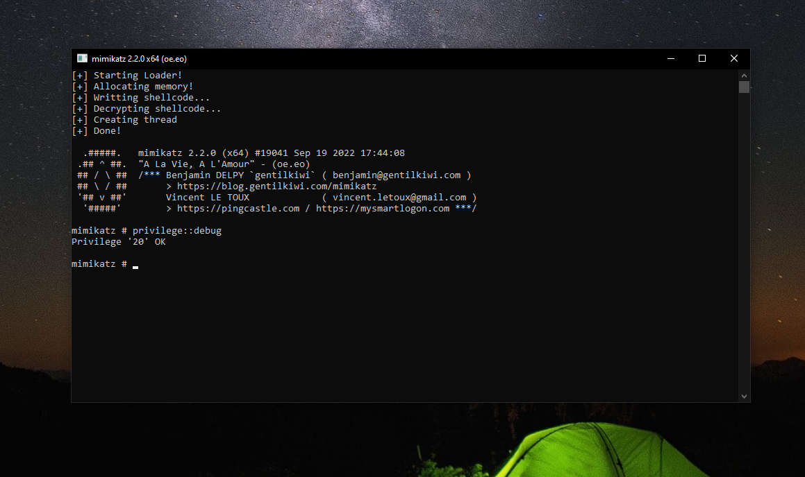
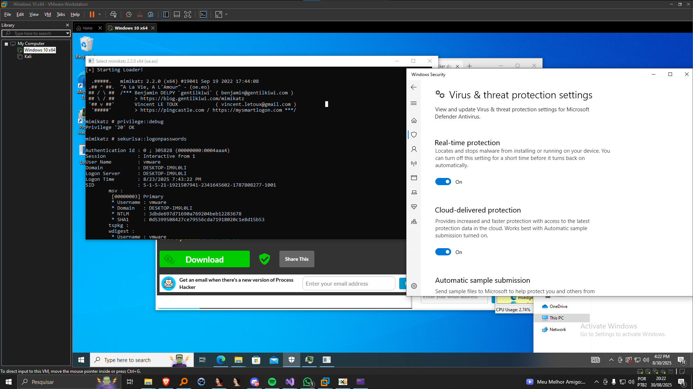
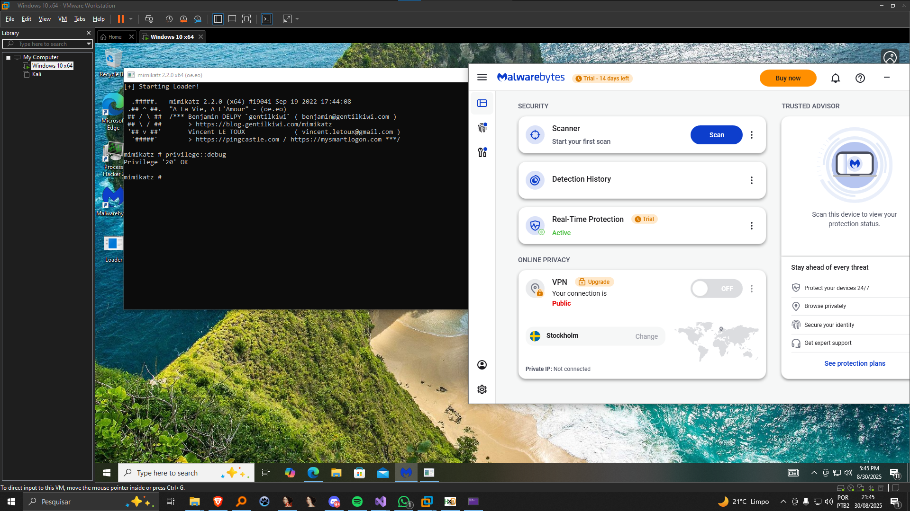

# Shellcode Loader with Indirect Syscalls

This is a basic shellcode loader that implements the concept of **Indirect Syscalls** in practice. I developed this while studying antivirus evasion techniques.

> ⚠️ This loader is extremely simple, has no string encryption, and is **not intended for real-world use**. It is only a study project to understand how indirect syscalls work.

---

## Features

- Dynamically obtains the **Syscall Number (SSN)** for each function at runtime, avoiding hardcoded values.
- Allocates executable memory using `NtAllocateVirtualMemory` via syscall.
- Copies and decrypts shellcode in memory (simple XOR).
- Creates threads to execute the shellcode using `NtCreateThreadEx` via syscall.
- Waits for the thread to finish using `NtWaitForSingleObject`.
- Avoids direct usage of Windows APIs, increasing stealth against automatic analysis.
- The shellcode (e.g., Mimikatz) was generated with **Donut** before applying XOR encryption.

---

## About Indirect Syscalls

In Windows, many API functions (`NtAllocateVirtualMemory`, `NtCreateThreadEx`, etc.) are just **wrappers** that directly call syscalls in the kernel. A syscall is the way to communicate with the Windows kernel to perform privileged operations.

---

### How Indirect Syscalls Work

In Windows, most native API functions exported by `ntdll.dll` are just lightweight wrappers around kernel syscalls. A typical wrapper does the following:

1. Loads the **Syscall Number (SSN)** for that function into the `eax` register.
2. Executes the `syscall` instruction (`0x0F 0x05`), which transitions from **user mode** to **kernel mode**.
3. Returns the result to the caller.

Normally, these wrappers are called directly by user programs. However, security products often monitor these API calls or hook them to intercept suspicious behavior.

**Indirect Syscalls** bypass this monitoring by:

- Dynamically locating the **syscall stub** in memory, instead of calling the exported API function.
- Retrieving the **SSN at runtime**, rather than relying on hardcoded numbers.
- Calling the syscall stub directly, without passing through the hooked or monitored API wrapper.

This approach allows a program to invoke kernel functions with minimal user-mode footprint, making it harder for antivirus and EDR systems to detect or intercept the calls.

---

### Why Use Indirect Syscalls for Evasion

- **Avoids antivirus signatures:** Many antiviruses detect well-known API functions (`VirtualAlloc`, `CreateThread`) by their memory signatures.
- **Bypasses user-mode hooks:** Some security solutions hook Windows APIs. Calling syscalls directly bypasses these hooks.
- **More stealthy:** The code does not rely on fixed addresses, making it harder for static scanners to identify known shellcode injection patterns.

---

## Demonstration

The images below show examples of this loader running mimikatz shellcode in different antivirus environments.
> ⚠️ These images are from a previous version of the loader that included some layers of encryption. This current version is extremely simple and for educational purposes only.

**Running on Windows Defender:**  

**Running on Malwarebytes:**  

---

In summary, **Indirect Syscalls** allow Windows functions to be executed dynamically and discreetly, making the loader less detectable and useful for studying evasion techniques and malware analysis.
